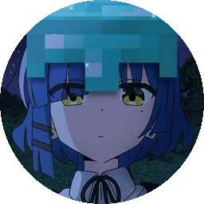

 

 

  

### Sekilas

| **Versi terbaru** | **Ukuran** | **Minimum** | **Akun** |
|:--:|:--:|:--:|:--:|
| dibaca dari rilis | ± 4 MB | Android 8.0 | Google (opsional) |

### Apa yang ada di dalamnya

<table>
<tr>
<td width="33%" valign="top" align="center">

**Beranda**

Anime populer bergiliran, chip genre, pembaruan terbaru, populer, dan rekomendasi dalam satu halaman.

</td>
<td width="33%" valign="top" align="center">

**Pemutar**

Pilih resolusi, atur kecepatan 0,25×–2×, subtitle, kunci layar, layar penuh, maju-mundur 10 detik.

</td>
<td width="33%" valign="top" align="center">

**Koleksi**

Bookmark dan riwayat tontonan yang ikut akunmu, lengkap dengan garis progres dan lanjut-tonton.

</td>
</tr>
<tr>
<td valign="top" align="center">

**Jelajah**

Genre, tipe (TV · Movie · OVA · ONA · Special), dan daftar alfabetis A–Z.

</td>
<td valign="top" align="center">

**Jadwal**

Jadwal rilis Senin sampai Minggu, dengan tab per hari.

</td>
<td valign="top" align="center">

**Pencarian**

Hasil muncul sendiri sambil kamu mengetik — tanpa perlu menekan tombol apa pun.

</td>
</tr>
<tr>
<td valign="top" align="center">

**Komentar**

Diskusi di tiap episode, balasan bertingkat, dan komentar Developer yang disematkan.

</td>
<td valign="top" align="center">

**Unduhan**

Tautan unduhan multi-server untuk setiap episode, dipisah per kualitas.

</td>
<td valign="top" align="center">

**Pembaruan mandiri**

Versi baru ditawarkan, diunduh, lalu dibuka pemasangnya sendiri. Tinggal tekan Pasang.

</td>
</tr>
</table>

### Tampilan

<table>
<tr>
<td align="center" width="50%">
  
<b>Maskot Kyora</b> menyambutmu di halaman pembuka, login, dan kartu profil.
</td>
<td align="center" width="50%">
  
<b>Ikon aplikasi</b> dibuat terpisah per kepadatan layar supaya tetap tajam.
</td>
</tr>
</table>

### Cara memasang

<table>
<tr>
<td width="33%" valign="top" align="center">
 
<b>Unduh</b> APK terbaru dari halaman Releases.
</td>
<td width="33%" valign="top" align="center">
 
Buka berkasnya, lalu <b>izinkan pemasangan</b> dari sumber ini bila diminta.
</td>
<td width="33%" valign="top" align="center">
 
Kalau ada versi lama, <b>hapus dulu</b> — tanda tangannya berbeda.
</td>
</tr>
</table>

> Setelah terpasang sekali, pembaruan berikutnya berjalan otomatis: Kyora memeriksa versi baru,
> mengunduh APK-nya, membuka layar izin bila perlu, lalu membuka pemasang Android.

### Persyaratan

| | |
|:--|:--|
| **Android** | 8.0 (API 26) atau lebih baru |
| **Ruang** | sekitar 4 MB |
| **Akun** | Google — hanya untuk koleksi dan komentar |
| **Izin** | Internet, dan izin pemasangan paket untuk pembaruan mandiri |

### Pertanyaan yang sering muncul

<b>Muncul peringatan "sumber tidak dikenal" saat memasang — berbahaya?</b>

 

Tidak. Itu peringatan bawaan Android untuk APK yang tidak berasal dari Play Store. Aktifkan
izinnya sekali, lalu pemasangan berjalan normal.

<b>Bisa dipakai tanpa login?</b>

 

Bisa untuk menonton dan menjelajah katalog. Login dibutuhkan untuk menyimpan koleksi, menyimpan
riwayat, dan ikut berkomentar.

<b>Koleksi hilang setelah ganti perangkat?</b>

 

Masuk dengan akun yang sama, lalu buka **Profil → Sinkronkan ulang data akun**.

<b>Video tidak mau diputar?</b>

 

Coba episode atau server lain dari menu unduhan. Kalau masalahnya berulang pada satu judul,
laporkan supaya bisa diperiksa.

### Dikembangkan oleh [Gxyenn](https://github.com/Gxyenn)

Kyora hanya pemutar. Seluruh video dialirkan dari sumber yang disediakan penyedia katalog; 
tidak ada konten yang di-host di repositori ini.

  

  

